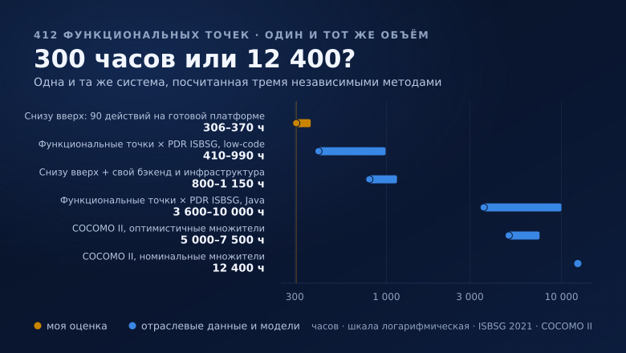

# Оценил проект в 300 часов, заказчик сказал «дорого». Пошёл проверять, оказалось — дёшево

## TL;DR

Я оценил доработку учётной системы в 300 часов, заказчик ответил, что это очень много. Я для него посчитал тот же объём тремя независимыми способами: снизу вверх по пользовательским действиям, через функциональные точки с отраслевыми показателями производительности ISBSG и через COCOMO II.

Результат оказался обратным ожидаемому. По отраслевой статистике этот объём — **412 функциональных точек** — стоит от ~990 часов (90-й процентиль low-code-проектов в репозитории ISBSG) до ~3 600 часов (медиана Java-проектов там же) и до ~12 400 часов по номинальному COCOMO II. Моя оценка в 300 часов — это 0,73 часа на функциональную точку, то есть **ниже минимума** всей low-code-выборки ISBSG.

Вывод, который я забираю себе: спорить «много или мало» бессмысленно, пока не назван состав работ и заложенная производительность. Любая оценка в часах — это в первую очередь заявление о допущениях, и моё было очень оптимистичным.

Все расчёты в статье воспроизводимы: приведены исходные счётчики, веса, формулы и ссылки на источники цифр.

## Откуда я смотрю на эту тему

Я делаю учётные системы для бизнеса — заявки, склад, производство, расчёты с исполнителями — и последние годы занимаюсь low-code-платформой, на которой такие системы собираются. Это моя профессиональная деформация и одновременно конфликт интересов, поэтому в тексте нет ни названия продукта, ни ссылок на него: цифры и методы, которые я привожу, к конкретной платформе не привязаны и проверяются по открытым источникам.

Пришло очередное ТЗ, я дал оценку, оценка не понравилась. Мотив возражения - с ИИ сейчас всё делается за вечер. Я попытался объяснить заказчику текущие реалии и получил результат, который в переговорах мне скорее мешает, чем помогает.

## Что за система

Обезличенно: внутренняя учётная система сервисной компании. Мобильный веб-интерфейс для исполнителей, десктопный — для администраторов.

- **8 предметных сущностей**: записи о работах, проекты, исполнители с прайсом, задачи с комментариями, справочники, пользователи и роли, файлы (фото и голосовые), настройки.
- **13 таблиц** в модели данных.
- **Экономика**: наценка, комиссия, доля владельца — с фиксацией ставок на момент операции.
- **Интеграции**: Google Sheets, корпоративный таск-трекер, S3-совместимое хранилище, распознавание голоса для заполнения формы.
- **Требования сверх веба**: офлайн-режим с очередью, PWA-установка, нативные сборки для двух сторов.

Инвентаризация интерфейса и API:

| Что считаем | Количество |
|---|---|
| Корневые экраны (вход, выбор проекта, каркас) | 3 |
| Вкладки и подвкладки | 13 |
| Админ-разделы | 7 |
| Значимые модальные окна и панели | ≈ 17 |
| **Всего UI-поверхностей** | **≈ 40** |

| Домен API | Эндпоинтов |
|---|---|
| Аутентификация (вход, обновление токена, выход, смена PIN, профиль) | 5 |
| Записи и справочники | 6 |
| Фото и аудио (выдача ссылки, подтверждение, галерея, удаление) | 4 |
| Заработок и планы | 6 |
| Задачи и комментарии | 11 |
| Исполнители, прайс, видимость | 10 |
| Настройки и голосовое заполнение | 3 |
| Админка (проекты, пользователи, справочники, права, роли, интеграции, аналитика, экспорт) | ≈ 32 |
| **Итого** | **≈ 77** |

Плюс действия, у которых нет отдельного вызова API: голосовой ввод, офлайн-очередь, черновики, фильтры и поиск, тема оформления, повтор последней записи. Суммарно получается **≈ 90 пользовательских действий**.

Эти три числа — 40 поверхностей, 77 эндпоинтов, 90 действий — дальше используются во всех трёх методах.

## Метод 1: снизу вверх, по действиям

### Из чего состоит одно действие

Оценивать «экран» бессмысленно: в экране может быть одно действие, а может быть двенадцать. Считаю действия, и для каждого — полный цикл, а не только основной сценарий:

| Составляющая | Часы |
|---|---|
| Основной сценарий (запрос, обработка, отрисовка) | 0,5–1,0 |
| Валидация входных данных | 0,2–0,4 |
| Права: кто видит, кто меняет, кто не видит вовсе | 0,2–0,4 |
| Пустое состояние и состояние загрузки | 0,1–0,3 |
| Ошибки: сеть, 5xx, конфликт параллельной правки | 0,3–0,6 |
| Отражение в списках, отчётах и агрегатах | 0,3–0,6 |
| Автотест | 0,3–0,6 |
| Ручная проверка и приёмка | 0,3–0,5 |
| **Итого на одно среднее действие** | **2,2–4,4** |

Это и есть источник «средних трёх часов». Отдельно подчеркну: половина строк таблицы — не разработка фичи, а её обвязка. Именно она обычно выпадает из интуитивной оценки, потому что в ТЗ про неё не пишут.

### Среднее врёт — считаем распределением

Средние 3 часа обманчивы: действия распределены не нормально, а с длинным хвостом. Модель, которой я пользуюсь:

| Класс действия | Доля | Кол-во | Часов на действие | Итого |
|---|---|---|---|---|
| Простое (CRUD по справочнику, переключатель, фильтр) | 60% | 54 | 1 | 54 |
| Среднее (форма с расчётом, список с правами, экспорт) | 30% | 27 | 4 | 108 |
| Тяжёлое (экономика со снапшотами, ролевая матрица, офлайн-очередь, сведение отчёта) | 10% | 9 | 16 | 144 |
| **Итого** | | **90** | | **306** |

Шкала 1 / 4 / 16 — геометрическая с шагом ×4; она грубая, но воспроизводимая, и её легко оспорить конкретными цифрами вместо ощущений. 306 часов — это и есть та самая «оценка в 300 часов».

Чувствительность модели:

- хвост 12 тяжёлых действий вместо 9 → **354 ч** (+16%);
- простые действия по 1,5 часа вместо 1 → **333 ч** (+9%);
- обе поправки вместе → **381 ч** (+25%).

То есть даже без изменения объёма работ разброс модели — четверть оценки. Отсюда стандартная надбавка +20–30% на приёмку и багфикс, которую я обычно и называю заказчику отдельной строкой.

### Чего в этих 300 часах нет

Принципиальный момент: 306 часов — это стоимость доведения 90 действий **поверх готового бэкенда**. Если бэкенда нет, добавляются работы, которых нет ни в одном ТЗ, потому что заказчик считает их само собой разумеющимися:

| Работа, которой нет в ТЗ | Часы |
|---|---|
| Инфраструктура и каркас (контейнеры, CI/CD, конфигурация, объектное хранилище, кэш) | 40–60 |
| Модель данных и миграции (13 таблиц, ограничения, индексы) | 20–30 |
| Аутентификация и защита (токены, хеши, лимиты попыток, блокировки, журнал) | 24–36 |
| Роли, права, изоляция данных по проекту | 20–30 |
| Транспортный слой (кэш, очередь, обновление сессии, офлайн) | 40–60 |
| Тестирование (бэкенд + сквозные сценарии) | 40–70 |
| Наблюдаемость и бэкапы (алерты, восстановление на момент времени) | 16–28 |
| Нативные сборки и публикация в сторах | 40–70 |
| **Итого** | **240–384** |

Складывая: доводка действий (306, с надбавкой ~370) + инфраструктура (240–384) + адаптация фронта — получается **800–1150 часов** для варианта «с нуля» и **500–725 часов**, если существующий фронтенд переиспользуется и меняется только транспорт.

Это первый метод. Он честный, но у него врождённый порок: я оцениваю сам себя, своей же меркой. Поэтому дальше — два способа проверки, которые про меня ничего не знают.

## Метод 2: функциональные точки и отраслевая производительность

Функциональные точки (IFPUG) считают не код, а функциональность с точки зрения пользователя. Метрике сорок лет, она стандартизована (ISO/IEC 20926), и главное — по ней есть открытая отраслевая статистика.

Считаю по стандартным весам: внутренние логические файлы (ILF) 7/10/15, внешние интерфейсные файлы (EIF) 5/7/10, вводы (EI) 3/4/6, выводы (EO) 4/5/7, запросы (EQ) 3/4/6 — за низкую/среднюю/высокую сложность.

| Тип | Что вошло | Расчёт | FP |
|---|---|---|---|
| ILF | 10 логических файлов: записи, проекты, исполнители+прайс, задачи+комментарии, справочники, пользователи+роли, файлы, настройки/брендинг, планы/цели, журнал аудита | 6×10 + 4×7 | 88 |
| EIF | 4 внешних источника: таблицы, таск-трекер, распознавание речи, объектное хранилище | 4×5 | 20 |
| EI | 36 вводов: CRUD по 8 сущностям (≈24), аутентификация (4), настройки и брендинг (3), права и роли (3), синхронизации (2) | 20×4 + 16×3 | 128 |
| EO | 14 выводов с вычислением: заработок, план, статистика за период, помесячно, график, четыре отчётных вкладки, аналитика активности, экспорт, сводка по исполнителю | 10×5 + 4×7 | 78 |
| EQ | 22 запроса без вычислений: списки, карточки, справочники, галерея, фильтрованные выборки | 12×4 + 10×3 | 78 |
| **UFP** | | | **392** |

Поправочный коэффициент VAF = 0,65 + 0,01 × TDI. Для системы с распределённой обработкой, ролевой моделью, офлайном, интеграциями и мобильным клиентом TDI ≈ 40, то есть VAF = 1,05.

**AFP = 392 × 1,05 ≈ 412 функциональных точек.**

Теперь производительность. ISBSG (International Software Benchmarking Standards Group) публикует Project Delivery Rate — часы на одну функциональную точку — по репозиторию из тысяч завершённых проектов. В [короткой работе 2021 года](https://www.isbsg.org/wp-content/uploads/2022/05/Short-Paper-2021-12-Productivity-Java-Vs-Low-Code-Projects.pdf) сравниваются 648 Java-проектов и 58 low-code-проектов (Mendix, OutSystems, Salesforce), отобранных по качеству данных A/B:

| Выборка ISBSG | PDR, ч/FP | 412 FP это |
|---|---|---|
| Java, медиана | 8,7 | ≈ 3 600 ч |
| Java, 90-й процентиль | 24,2 | ≈ 10 000 ч |
| Low-code, 90-й процентиль | 2,4 | ≈ 990 ч |
| Low-code, минимум выборки | 1,0 | ≈ 410 ч |

А вот как в этой шкале выглядят мои собственные оценки:

| Мой вариант | Часы | PDR, ч/FP |
|---|---|---|
| Доводка 90 действий поверх готовой платформы | 300 | **0,73** |
| Полный проект на платформе | 275–470 | 0,67–1,14 |
| Миграция со своим бэкендом, фронт существует | 500–725 | 1,21–1,76 |
| Полностью с нуля | 800–1150 | 1,94–2,79 |

Это неприятное открытие. Мой вариант «с нуля» по производительности попадает не в Java-медиану (8,7), а в диапазон low-code-платформ. А оценка в 300 часов — 0,73 ч/FP — вообще ниже минимума всей low-code-выборки ISBSG.

## Метод 3: COCOMO II

Третья проверка — из другой школы. COCOMO II оценивает трудозатраты от размера кода:

**PM = 2,94 × KSLOC^E × EAF**, где E ≈ 1,0997 при номинальных масштабных факторах, а один человеко-месяц принят равным 152 часам ([Model Definition Manual](https://athena.ecs.csus.edu/~buckley/CSc231_files/Cocomo_II_Manual.pdf)).

Размер получаю из функциональных точек через gearing factor. По [таблице QSM](https://www.qsm.com/resources/function-point-languages-table) для JavaScript это 45–63 строки на точку (среднее 54); беру 50 как центральную оценку для смешанного стека.

- 412 FP × 50 ≈ **20,6 KSLOC**
- PM = 2,94 × 20,6^1,0997 ≈ **82 человеко-месяца** ≈ **12 400 часов** при номинальных множителях

Номинальные множители — это «средний проект средней команды со средними требованиями». Мой случай другой: один сильный разработчик, знакомый домен, современный инструментарий, невысокие требования к надёжности (это не медицина и не платёжный процессинг). Совокупный множитель EAF в таком раскладе реалистично 0,4–0,6:

| EAF | Человеко-месяцев | Часов |
|---|---|---|
| 0,4 | 33 | ≈ 5 000 |
| 0,5 | 41 | ≈ 6 200 |
| 0,6 | 49 | ≈ 7 500 |

Даже с очень оптимистичными множителями COCOMO II даёт **5 000–7 500 часов** — в шесть-девять раз больше моей оценки «с нуля».

## Сводка: три метода, один объём

| Метод | Что именно считает | Результат |
|---|---|---|
| Снизу вверх, по действиям | доводка 90 действий поверх готового бэкенда | ≈ 306 ч (с надбавкой ≈ 370) |
| Снизу вверх + инфраструктура | то же со своим бэкендом и фронтом | 800–1150 ч |
| FP + PDR ISBSG (low-code) | тот же объём на платформе, по отраслевой выборке | 410–990 ч |
| FP + PDR ISBSG (Java) | тот же объём в традиционном стеке, по отраслевой выборке | 3 600–10 000 ч |
| COCOMO II | полный жизненный цикл, оптимистичные множители | 5 000–7 500 ч |

Разброс — в двадцать раз. Это не значит, что какой-то метод врёт: они считают **разный состав работ**.

В отраслевые цифры входит то, чего в оценке одиночки нет по определению:

- аналитика и формализация требований, приёмо-сдаточная документация;
- управление проектом, отчётность, согласования;
- отдельная роль тестирования и полноценный цикл дефектов;
- коммуникационные издержки команды — те самые квадратичные связи, из-за которых удвоение людей не удваивает скорость;
- корпоративные процедуры: релизные окна, ревью безопасности, приёмка со стороны заказчика.

А в моей оценке есть то, чего нет у среднего проекта из репозитория: готовая платформа, закрывающая аутентификацию, права, аудит, CRUD-API, отчёты, файлы и деплой; один человек вместо команды; знакомый домен; отсутствие формального процесса.

Отсюда практический вывод, ради которого всё и считалось: **оценка снизу вверх — это нижняя граница при идеальных допущениях, а не «сколько это стоит»**. Она верна ровно до тех пор, пока верны допущения. Стоит убрать одно — например, оказывается, что нужен второй человек, или что заказчик хочет приёмочную документацию, — и цифра уезжает в сторону отраслевой.

## Что это значит для спора «300 часов — это много»

Ничего из посчитанного не делает заказчика неправым: у него бюджет, а не функциональные точки. Но предмет спора смещается.

«Много или мало» — вопрос без ответа, пока не заданы три других:

1. **Что входит в оценку?** Только доводка действий? Плюс инфраструктура? Плюс приёмка и документация? Разница между первым и третьим — в 3–4 раза на одном и том же ТЗ.
2. **Какая производительность заложена?** Мои 0,73 ч/FP — это рекорд отраслевой выборки. Если исполнитель не показывает, за счёт чего он попадает в такую производительность (готовая платформа, генерация, переиспользование), то оценка не оптимистичная, а фантастическая.
3. **Что произойдёт, если допущение не сработает?** Кто платит за второго разработчика, за миграцию данных, за неожиданный офлайн-режим.

И отдельно — способ сделать большую оценку переносимой. Резать надо не оценку, а объём: очередь рабочих мест по приносимой пользе, каждое — до рабочего состояния и на реальных данных. Сорок наполовину готовых экранов не стоят ничего, пять работающих — стоят.

## Где такие оценки ломаются

Все три метода считают известный объём. Ломаются они на неизвестном:

- **Миграция накопленных данных.** Обычно её нет в ТЗ, и обычно она стоит десятки часов: старые справочники, дубликаты, записи без обязательных полей.
- **Чужие API.** Оценка «интеграция — 16 часов» верна для документированного API и рассыпается на лимитах, недокументированных полях и чужих релизах.
- **Офлайн.** Это не фича, а свойство архитектуры: очередь, разрешение конфликтов, идемпотентность. Дописать позже дороже, чем заложить сразу.
- **Приёмка.** Заказчик впервые видит систему на своих данных — и именно тогда выясняется, что «мастер» в его компании означает не то, что в модели.

Отдельный риск — вариант «сделаю сам с ИИ, зачем мне ваши 300 часов». Я к таким попыткам отношусь без иронии: инструменты действительно сильные. Но данные по ним уже накоплены, и они устойчиво описывают одну и ту же кривую.

Эдди Османи (Google Chrome DX) в декабре 2024 назвал это [«проблемой 70%»](https://addyo.substack.com/p/the-70-problem-hard-truths-about): первые 70% решения появляются на удивление быстро, а оставшиеся 30% — крайние случаи, безопасность, интеграция с реальностью — остаются такими же трудными, как раньше. Систематический обзор серой литературы ([arXiv:2510.00328](https://arxiv.org/abs/2510.00328), ICSE-SEIP 2026, 154 источника) фиксирует ровно этот разрыв: практики приходят за скоростью, получают быстрый результат и сами описывают его как «быстро, но с изъянами», а контроль качества при этом систематически выпадает — проверку пропускают, принимают код без изменений или поручают проверку тому же инструменту, который его написал.

Почему разбор завалов даётся тяжело, показывает эксперимент Anthropic ([arXiv:2601.20245](https://arxiv.org/abs/2601.20245), n = 52): участники, решавшие задачу с ИИ, показали на 17% худшее понимание кода, который только что получили. Разделяет не опыт, а поведение — те, кто просил объяснений и задавал уточняющие вопросы, удерживали материал заметно лучше.

И цена ошибки в правах: сканирование 1 645 приложений, собранных на одной популярной AI-платформе, показало, что у 170 из них (10,3%) данные пользователей были доступны любому — сгенерированная схема базы приезжала без политик разграничения доступа.

Ни один из этих фактов не говорит «не делайте сами». Они говорят другое: в оценке варианта «сам с ИИ» надо закладывать не только часы сборки, но и часы на то, чтобы понять и проверить сделанное. В моих терминах — это те же 90 действий, только с неизвестной производительностью.

## Как посчитать свой проект за час

Рецепт целиком воспроизводим, никаких инструментов не нужно:

1. **Инвентаризация.** Выпишите UI-поверхности (экраны, вкладки, значимые модалки) и действия. Действие — то, после чего в системе что-то изменилось или пользователь что-то узнал.
2. **Классификация.** Разложите действия на простые / средние / тяжёлые. Если сомневаетесь — кладите в более тяжёлый класс, интуиция систематически занижает.
3. **Сумма снизу вверх.** Умножьте на 1 / 4 / 16 часов и сложите. Добавьте 20–30% на приёмку.
4. **Инфраструктура.** Если бэкенда нет — добавьте строки из таблицы выше. Если платформа есть, честно перечислите, что именно она закрывает.
5. **Перекрёстная проверка.** Посчитайте функциональные точки (это час работы по стандартным весам) и умножьте на PDR из отраслевой выборки. Если ваша оценка даёт производительность лучше 90-го процентиля индустрии — либо у вас есть объяснение, либо у вас проблема.
6. **Календарь.** Продуктивных часов в месяце у одного человека — около 120, а не 168. Делите трудозатраты на 120, а не на «сколько в месяце рабочих часов».

Последний шаг — самый недооценённый. Он превращает «300 часов» в «два с половиной месяца одним человеком», и дальше разговор идёт уже про сроки, а не про абстрактную цифру.

## Ответы на возможные вопросы

**Функциональные точки — это же вчерашний день, зачем они в 2026-м?** Как метрика планирования — возможно. Как единица сравнения — нет: это единственная широко распространённая мера объёма, не зависящая от языка и стека, и по ней есть открытая отраслевая статистика. Мне не нужно, чтобы FP предсказывали срок; мне нужно перевести свою оценку в шкалу, где её можно сравнить с тысячами чужих проектов.

**Вы подогнали подсчёт FP под нужный результат.** Проверьте: все счётчики и веса в таблице. Даже если сдвинуть TDI на ±5 (VAF 1,00–1,10), AFP меняется с 392 до 431 — на выводы это не влияет, потому что расхождение между методами не в процентах, а в разах.

**COCOMO II калиброван на водопадных проектах девяностых.** Да, и поэтому он даёт верхнюю границу. Я и использую его как верхнюю границу, а не как прогноз. Показательно, что он согласуется с ISBSG-медианой по порядку величины, хотя это независимые данные.

**Почему бы просто не оценивать в story points и не считать velocity?** Потому что velocity нельзя предъявить заказчику до начала работ, а сравнить с индустрией — тем более. Для внутреннего планирования итерациями story points лучше; для разговора «сколько это будет стоить» нужна шкала, внешняя по отношению к команде.

**Так сколько всё-таки стоит эта система?** Честный ответ: от 300 часов, если принять все мои допущения, до 5 000+, если не принимать ни одного. Диапазон — не признак плохой оценки, а признак того, что оценивают не систему, а сочетание системы с условиями её создания.

## Вопросы к комментариям

1. Кто-нибудь считает функциональные точки на реальных проектах — или все давно перешли на «оценим итерациями и посмотрим»?
2. Если вы сверялись с ISBSG или другой отраслевой базой: насколько ваша фактическая производительность отличалась от медианы выборки?
3. Какой у вас коэффициент «невидимой» работы — инфраструктура, права, наблюдаемость — от общей трудоёмкости? У меня стабильно выходит 30–40% в проектах со своим бэкендом.
4. Кто пробовал считать по-старому проект, собранный с ИИ-агентами? Интересны фактические часы, а не ощущение скорости.

## Фактчек перед публикацией

- Проверить, что ссылка на PDF ISBSG открывается, и что цифры в тексте (медиана Java 8,7; P90 24,2; low-code минимум 1,0; P90 2,4; выборки 648 и 58 проектов) совпадают с документом.
- Пересчитать арифметику публикуемой версии: UFP 392, VAF 1,05, AFP 412; 412 × 8,7 ≈ 3 584; 412 × 2,4 ≈ 989; 2,94 × 20,6^1,0997 ≈ 82 PM; 82 × 152 ≈ 12 400 ч.
- Убедиться, что в тексте нет названия компании, продукта и ссылок на них (issue #506) — кроме раскрытия аффилиации в разделе «Откуда я смотрю на эту тему».
- Проверить, что обезличивание заказчика не восстанавливается по деталям: отрасль, состав сущностей и интеграций описаны в общем виде.
- Решить по canonical: если версия в корпоративном блоге остаётся первичным текстом — оставить `canonicalUrl`; если habr-версия расходится с ней настолько, что это самостоятельная статья, canonical лучше снять.
- Иллюстрация (КДПВ) готова: `assets/kdpv-tri-metoda.png` — 780×440 под обложку Хабра, `@2x` — 1560×880 для вставки в текст. При публикации загрузить файл в Хабр и заменить относительную ссылку на адрес habrastorage; пересобрать при правке цифр — `node scripts/generate-kdpv-habr-effort.mjs`.
