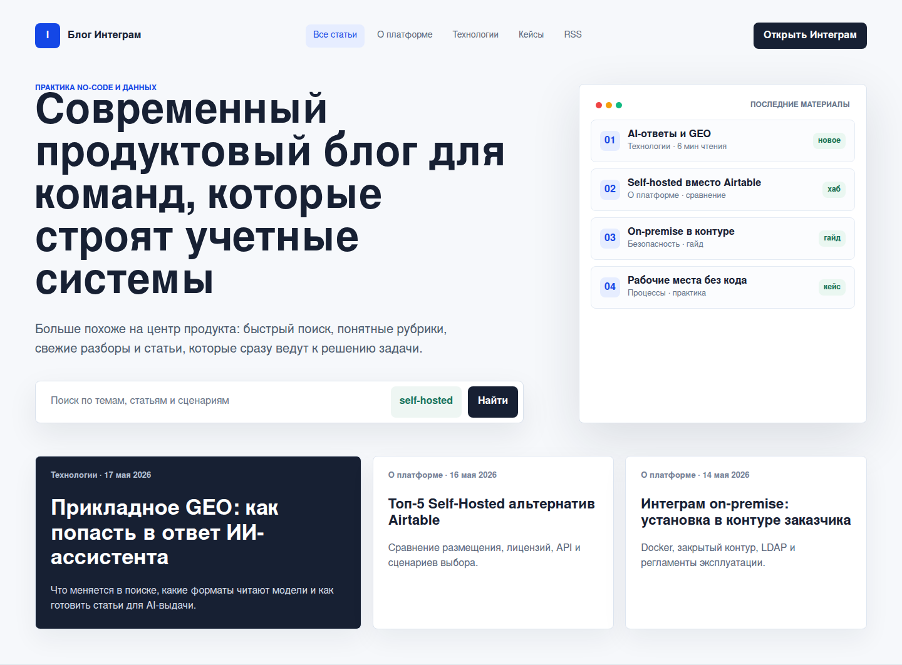
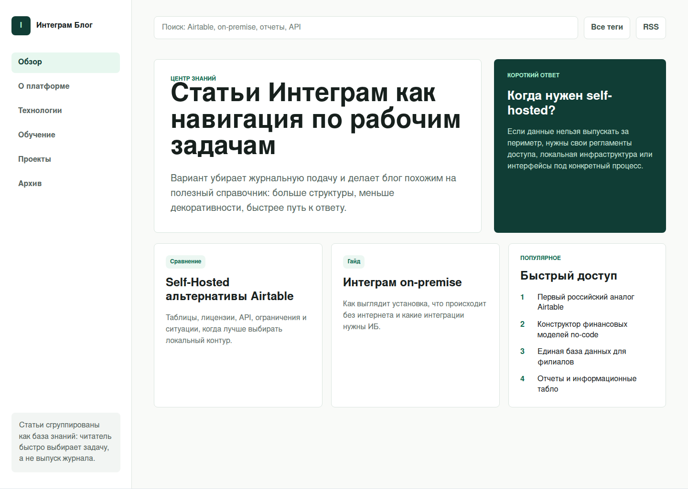
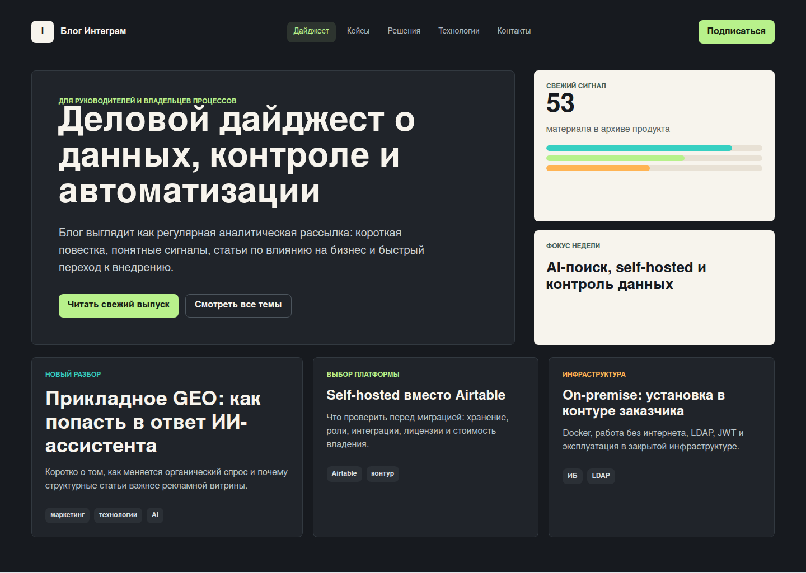

# Issue 246: Alternative Blog Styling

The current `blog-v2` direction reads as an editorial journal. These three rendered alternatives explore a more current product-oriented look with system UI fonts, stronger navigation, and clearer article discovery.

## 1. Product Newsroom

Best fit when the blog should feel close to the main product site: search first, article cards second, and a visible summary of the latest practical materials.

Repo path: `docs/screenshots/issue-246-blog-alt-01-product-newsroom.png`

## 2. Knowledge Hub

Best fit when the blog should behave like a structured knowledge base: persistent categories, prominent search, answer blocks, and task-based entry points.

Repo path: `docs/screenshots/issue-246-blog-alt-02-knowledge-hub.png`

## 3. Executive Digest

Best fit when the blog should speak to owners and managers: concise issue framing, business impact, and a darker analytical presentation.

Repo path: `docs/screenshots/issue-246-blog-alt-03-executive-digest.png`

Source render: [`experiments/issue-246-blog-alternatives.html`](../experiments/issue-246-blog-alternatives.html).
